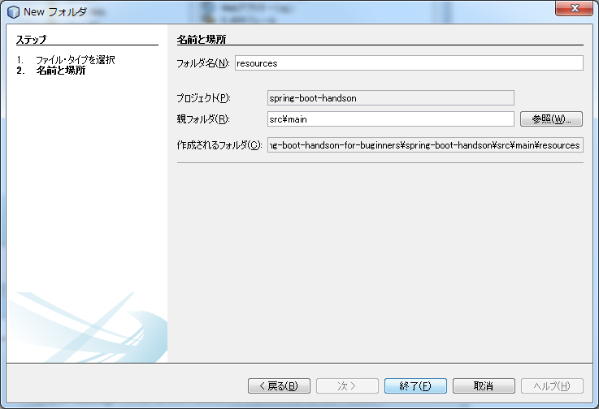
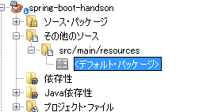
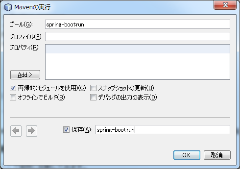

# mavenのインストールからプロジェクトの作成

## mavenとは

mavenはビルドツールです。

Javaのソースコードのコンパイル、ライブラリ(jar)の作成を行えます。

それだけだと利点がわかりにくいのですが、mavenはライブラリ(jar)の依存関係を定義しておくだけで、自動的に依存するライブラリをインターネット上から取得してきてくれます。

たとえば、JavaからExcelファイルを扱うライブラリである[Apache POI](https://poi.apache.org/) を使用したい場合、ライブラリの依存関係を含めると以下のライブラリがすべて必要になります。

+ poi-X.XX.jar
+ commons-codec-X.XX.jar
+ commons-logging-X.X.jar
+ log4j-X.X.XX.jar

poi-X.XX.jarだけをリンクさせてもプログラムは動作しません。Apache POIがどのライブラリに依存しているのかを知っていないとApache POIを使用することが出来ません。
手動でライブラリの管理を行うのは無理があります。mavenはApache POIが依存しているライブラリを検索して、必要なライブラリを取得してくれます。

Spring-bootもmavenを利用してライブラリの管理を行うことが出来ます。


## mavenのインストール

mavenのインストールを行います。

※NetBeansには組み込みのmavenが最初から設定されています。
この手順については飛ばしてもかまいません。

以下のURLよりバイナリを取得します。

https://maven.apache.org/download.cgi

※このハンズオンでは以下のファイルを直接取得します。

http://ftp.kddilabs.jp/infosystems/apache/maven/maven-3/3.3.9/binaries/apache-maven-3.3.9-bin.zip


落としてきたファイルをc:\apps\apache-maven-3.3.9-binに解凍します。
フォルダの下にbinができていることを確認してください。

※パスを変更する場合は以下適時読み替えてください。

システムからユーザー環境変数に以下の環境変数を追加します。

+ JAVA_HOME = すでにインストールしているjavaの場所 (ex. C:\Program Files\Java\jdk1.8.0_73)
+ M2_HOME = C:\apps\apache-maven-3.3.9 ※mavenの解凍先を指定してください。
+ PATH = %M2_HOME%\bin;%JAVA_HOME%\bin

※すでにPATHが設定されている場合は上書きせずに追記するようにしてください。

※MacやLinuxを使用している人は上記を参考に適切に設定してください。

コマンドプロンプトを開いて、mvn というコマンドを実行してみて、コマンドが見つかればインストール完了です。

## NetBeansでの新規プロジェクトの作成

ここからNetBeansで作業をしていきます。NetBeansを立ち上げてない場合は立ち上げてください。

### 新規プロジェクトの作成

+ 左上のファイル→新規プロジェクト(w)を選択します。
+ 新規プロジェクトからMaven→Javaアプリケーションを選択して、次へを押します。
+ プロジェクト名にspring-boot-handson、グループIDにmegascusを入れて完了を押します。


### pom.xml(mavenの設定ファイル)の編集

pom.xmlはmavenの設定ファイルです。pom.xmlに今回のハンズオンで使用するライブラリを追加していきます。
pom.xmlを以下のように書き直してください。

```xml:pom.xml
<?xml version="1.0" encoding="UTF-8"?>
<project xmlns="http://maven.apache.org/POM/4.0.0" xmlns:xsi="http://www.w3.org/2001/XMLSchema-instance" xsi:schemaLocation="http://maven.apache.org/POM/4.0.0 http://maven.apache.org/xsd/maven-4.0.0.xsd">
    <modelVersion>4.0.0</modelVersion>
    <groupId>megascus</groupId>
    <artifactId>spring-boot-handson-for-buginners</artifactId>
    <version>1.0-SNAPSHOT</version>
    <packaging>jar</packaging>
    <properties>
        <java.version>1.8</java.version>
    </properties>
    <parent>
        <groupId>org.springframework.boot</groupId>
        <artifactId>spring-boot-starter-parent</artifactId>
        <version>1.3.2.RELEASE</version>
    </parent>
    <dependencies>
        <dependency>
            <groupId>org.springframework.boot</groupId>
            <artifactId>spring-boot-starter-web</artifactId>
        </dependency>
        <dependency>
            <groupId>org.springframework.boot</groupId>
            <artifactId>spring-boot-starter-thymeleaf</artifactId>
        </dependency>
        <dependency>
            <groupId>org.springframework.boot</groupId>
            <artifactId>spring-boot-starter-data-jpa</artifactId>
        </dependency>
        <dependency>
            <groupId>com.h2database</groupId>
            <artifactId>h2</artifactId>
        </dependency>
    </dependencies>
</project>
```

pom.xmlの書き方については今回のハンズオンでは説明しません。
spring-bootではよく使用するライブラリの組み合わせをデフォルトで定義しており、その中から、

+ webシステムを作成するためのライブラリの組み合わせ(spring-boot-starter-web)
+ thymeleafテンプレートエンジンを使用するためのライブラリの組み合わせ(spring-boot-starter-thymeleaf)
+ jpaを利用してDBにアクセスするためのライブラリの組み合わせ(spring-boot-starter-data-jpa)
+ 組み込みデータベースであるH2を利用するためのライブラリの組み合わせ(h2)

を選択しています。
他にどのようなものがあるかは以下のページに載っています。(が、今回の範囲では扱いません)

http://docs.spring.io/spring-boot/docs/current-SNAPSHOT/reference/htmlsingle/#using-boot-starter-poms

※もしPCにmysql等がすでにインストールされている場合は、そちらを使用することも出来ます。その場合はh2への依存をdependencyタグごと消してください。

### 必要なライブラリの取得

依存するライブラリを取得します。
今回はmavenを使用しているため、すぐです。

プロジェクトからspring-boot-handsonを右クリックし、ビルドを選択してください。pom.xmlの内容が正しく、ネットワークに接続されていれば、依存ライブラリが勝手にダウンロードされます。


### spring-bootの設定ファイルの追加

プロジェクトからspring-boot-handsonを右クリックして、新規→フォルダを選択します。

フォルダ名にresources、親フォルダにsrc\mainを入力し、終了を押します。



以下のようにフォルダが作成されました。



作成したフォルダにapplication.yamlという名前で以下のファイルを追加します。


```yaml:application.yml
#example of application.yml
#これは開発用の設定です。
server.port: 8080
spring:
#    datasource:
#        url: jdbc:mysql://localhost:3306/mysql
#        username: mysql
#        password: mysql
    jpa:
        show-sql: false
        hibernate:
            ddl-auto: create-drop
        properties:
            hibernate:
                format_sql: true
    thymeleaf:
        cache: false
logging:
    level:
        org.hibernate.SQL: DEBUG
        org.hibernate.type: TRACE
    

```

開発時に必要な最低限の設定を最初から追加しています。
 #で始まる行はコメントアウトされています。mysqlを使用する場合はコメントアウトを解除してください。


### Mainクラスの追加

Spring-bootのアプリケーションは通常のJavaアプリケーションとして動作します。Javaアプリケーションのエントリポイントとなるmainメソッドを持った以下のクラスを作成してください。

megascus.spring.boot.handsonパッケージを右クリックして、新規→Javaクラスから作成できます。

megascus.spring.boot.handson.Main.java

```java:Main.java

package megascus.spring.boot.handson;

import org.springframework.boot.SpringApplication;
import org.springframework.boot.autoconfigure.SpringBootApplication;
import org.springframework.boot.builder.SpringApplicationBuilder;
import org.springframework.boot.context.web.SpringBootServletInitializer;

@SpringBootApplication
public class Main extends SpringBootServletInitializer {

    @Override
    protected SpringApplicationBuilder configure(SpringApplicationBuilder application) {
        return application.sources(Main.class);
    }

    public static void main(String[] args) {
        SpringApplication.run(Main.class, args);
    }
}
```

@SpringBootApplicationアノテーションはこのクラスのあるパッケージ以下をspring-bootの構成クラスとして扱い、springコンテナ(以下：コンテナと呼びます)で読み込むようにします。

spring-bootではこういったアノテーションを多用します。アノテーションが付いているクラスが出てきた場合、コンテナで読み込まれ、何かしらの処理をされるということだけ覚えておいてください。

ここまでで事前準備が完了しました。

## 最初の画面の作成

ここまで設定した内容が正しいかを確認するためにアクセスした場合に単純にメッセージを返すプログラムを書いてみます。

### RootControllerクラスの追加

以下のクラスを作成してください。

megascus.spring.boot.handson.RootController.java

```java:RootController.java

package megascus.spring.boot.handson;

import org.springframework.web.bind.annotation.RequestMapping;
import org.springframework.web.bind.annotation.RestController;

/**
 *
 * @author megascus
 */
@RestController
public class RootController {
    
    @RequestMapping("/")
    public String get() {
        return "hello world";
    }
}

```

@RequestMapping("/")でウェブアプリケーションの"/"(ルート)にアクセスした場合の定義を行っています。

## 実際に起動してみる

ここで実際に起動してみます。

プロジェクトを右クリックしてカスタム→ゴールを選択します。

ゴールに spring-boot:run、保存にチェックを入れ、spring-boot:runと入力しOKを押すと起動が始まります。



※今後起動させる場合はプロジェクトを右クリックしてカスタム→spring-boot:runを選択してください。

mavenから直接起動させたい場合はフォルダをプロジェクトルートに移動して以下のコマンドを入力します。

```
mvn spring-boot:run
```


起動させたら以下のURLにアクセスしてください。

http://localhost:8080/

無事に起動しているとhello worldと表示されるはずです。

表示されているのを確認したら、NetBeansの下のほうに表示されている出力画面から赤い四角のボタンを押してアプリケーションを終了させます。

これで、最初のアプリケーションの作成が完了しました。
