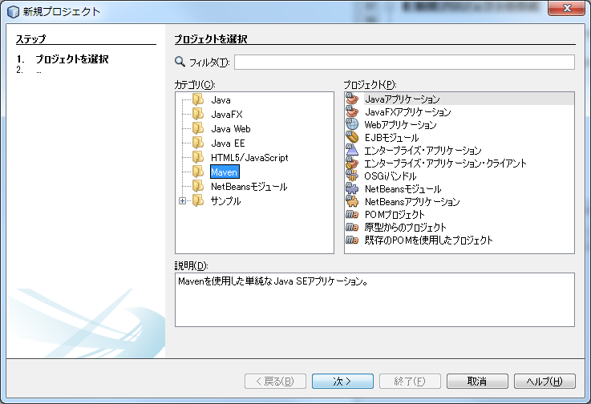
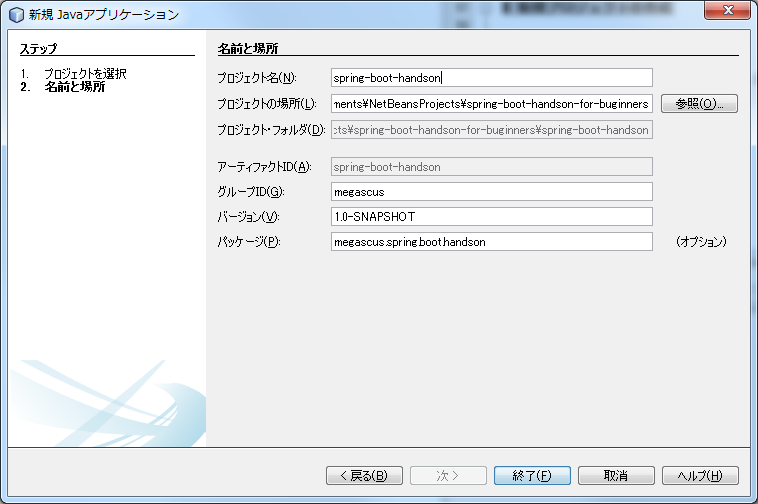

# mavenのインストールからプロジェクトの作成

## mavenとは

mavenはビルドツールです。

Javaのソースコードのコンパイル、ライブラリ(jar)の作成を行えます。

それだけだと利点がわかりにくいのですが、mavenはライブラリ(jar)の依存関係を定義しておくだけで、自動的に依存するライブラリをインターネット上から取得してきてくれます。

たとえば、JavaからExcelファイルを扱うライブラリである[Apache POI](https://poi.apache.org/) を使用したい場合、ライブラリの依存関係を含めると以下のライブラリがすべて必要になります。

+ poi-X.XX.jar
+ commons-codec-X.XX.jar
+ commons-logging-X.X.jar
+ log4j-X.X.XX.jar

poi-X.XX.jarだけをリンクさせてもプログラムは動作しません。Apache POIがどのライブラリに依存しているのかを知っていないとApache POIを使用することが出来ません。
手動でライブラリの管理を行うのは無理があります。mavenはApache POIが依存しているライブラリを検索して、必要なライブラリを取得してくれます。

Spring-bootもmavenを利用してライブラリの管理を行うことが出来ます。


## mavenのインストール

mavenのインストールを行います。

※NetBeansには組み込みのmavenが最初から設定されています。
この手順については飛ばしてもかまいません。

以下のURLよりバイナリを取得します。

https://maven.apache.org/download.cgi

※このハンズオンでは以下のファイルを直接取得します。

http://ftp.kddilabs.jp/infosystems/apache/maven/maven-3/3.3.9/binaries/apache-maven-3.3.9-bin.zip


落としてきたファイルをc:\apps\apache-maven-3.3.9-binに解凍します。
フォルダの下にbinができていることを確認してください。

※パスを変更する場合は以下適時読み替えてください。

システムからユーザー環境変数に以下の環境変数を追加します。

+ JAVA_HOME = すでにインストールしているjavaの場所 (ex. C:\Program Files\Java\jdk1.8.0_73)
+ M2_HOME = C:\apps\apache-maven-3.3.9-bin
+ PATH = %M2_HOME$\bin;%JAVA_HOME%\bin

※すでにPATHが設定されている場合は上書きせずに追記するようにしてください。

※MacやLinuxを使用している人は上記を参考に適切に設定してください。

コマンドプロンプトを開いて、mvn というコマンドを実行してみて、コマンドが見つかればインストール完了です。

# NetBeansでの新規プロジェクトの作成

ここからNetBeansで作業をしていきます。NetBeansを立ち上げてない場合は立ち上げてください。

## 新規プロジェクトの作成

+ 左上のファイル→新規プロジェクト(w)を選択します。
+ 新規プロジェクトからMaven→Javaアプリケーションを選択して、次へを押します。
+ プロジェクト名にspring-boot-handson、グループIDにmegascusを入れて完了を押します。




## pom.xml(mavenの設定ファイル)の編集

pom.xmlはmavenの設定ファイルです。pom.xmlに今回のハンズオンで使用するライブラリを追加していきます。
pom.xmlを以下のように書き直してください。

```xml:pom.xml
<?xml version="1.0" encoding="UTF-8"?>
<project xmlns="http://maven.apache.org/POM/4.0.0" xmlns:xsi="http://www.w3.org/2001/XMLSchema-instance" xsi:schemaLocation="http://maven.apache.org/POM/4.0.0 http://maven.apache.org/xsd/maven-4.0.0.xsd">
    <modelVersion>4.0.0</modelVersion>
    <groupId>megascus</groupId>
    <artifactId>spring-boot-handson-for-buginners</artifactId>
    <version>1.0-SNAPSHOT</version>
    <packaging>jar</packaging>
    <properties>
        <java.version>1.8</java.version>
    </properties>
    <parent>
        <groupId>org.springframework.boot</groupId>
        <artifactId>spring-boot-starter-parent</artifactId>
        <version>1.3.2.RELEASE</version>
    </parent>
    <dependencies>
        <dependency>
            <groupId>org.springframework.boot</groupId>
            <artifactId>spring-boot-starter-web</artifactId>
        </dependency>
        <dependency>
            <groupId>org.springframework.boot</groupId>
            <artifactId>spring-boot-starter-thymeleaf</artifactId>
        </dependency>
        <dependency>
            <groupId>org.springframework.boot</groupId>
            <artifactId>spring-boot-starter-data-jpa</artifactId>
        </dependency>
        <dependency>
            <groupId>com.h2database</groupId>
            <artifactId>h2</artifactId>
        </dependency>
    </dependencies>
</project>
```

pom.xmlの書き方については今回のハンズオンでは説明しません。
spring-bootではよく使用するライブラリの組み合わせをデフォルトで定義しており、その中から、

+ webシステムを作成するためのライブラリの組み合わせ(spring-boot-starter-web)
+ thymeleafテンプレートエンジンを使用するためのライブラリの組み合わせ(spring-boot-starter-thymeleaf)
+ jpaを利用してDBにアクセスするためのライブラリの組み合わせ(spring-boot-starter-data-jpa)
+ 組み込みデータベースであるH2を利用するためのライブラリの組み合わせ(h2)

を選択しています。
他にどのようなものがあるかは以下のページに載っています。(が、今回の範囲では扱いません)

http://docs.spring.io/spring-boot/docs/current-SNAPSHOT/reference/htmlsingle/#using-boot-starter-poms

※もしPCにmysql等がすでにインストールされている場合は、そちらを使用することも出来ます。その場合はh2への依存をdependencyタグごと消してください。