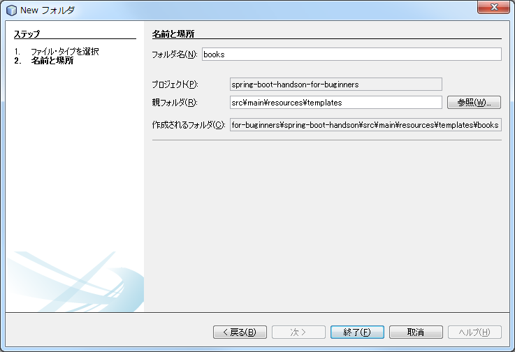
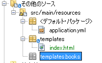

# htmlでの表示

ここでは前の章で作成したJPAのクラス(DBへのアクセスを行う)を使用して実際に画面を作成します。


## BookControllerの追加

以下のクラスを追加してください。

megascus.spring.boot.handson.controller.BookController.java  ※パッケージに注意

```java:BookController.java

package megascus.spring.boot.handson.controller;

import megascus.spring.boot.handson.model.BookService;
import megascus.spring.boot.handson.model.Book;
import org.springframework.beans.factory.annotation.Autowired;
import org.springframework.stereotype.Controller;
import org.springframework.ui.Model;
import org.springframework.validation.BindingResult;
import org.springframework.validation.annotation.Validated;
import org.springframework.web.bind.annotation.ModelAttribute;
import org.springframework.web.bind.annotation.RequestMapping;
import org.springframework.web.bind.annotation.RequestMethod;
import org.springframework.web.bind.annotation.RequestParam;

/**
 *
 * @author megascus
 */
@Controller
@RequestMapping("books") // booksというURLにマッピングしている
public class BookController {

    @Autowired
    BookService service;

    @ModelAttribute(value = "book") // 画面に表示したい初期データ bookという名前でthymeleafと共有する
    Book setUpForm() {
        return new Book();
    }

    @RequestMapping(method = RequestMethod.GET)
    String list(Model model) {
        model.addAttribute("books", service.findAll()); // booksという名前で一覧のデータをthymeleafと共有する
        return "books/list";
    }

    @RequestMapping(value = "create", method = RequestMethod.GET)
    String create() {
        return "books/create";
    }

    @RequestMapping(value = "create", method = RequestMethod.POST)
    String create(@Validated Book book, BindingResult result, Model model) {
        if (result.hasErrors()) {
            model.addAttribute("book", book);
            return "books/create";
        }
        service.save(book);
        return "redirect:/books";
    }

    @RequestMapping(value = "update", method = RequestMethod.GET)
    String update(@RequestParam Long id, Model model) {
        model.addAttribute("book", service.findOne(id));
        return "books/update";
    }

    @RequestMapping(value = "update", method = RequestMethod.POST)
    String update(@RequestParam Long id, @Validated Book book, BindingResult result, Model model) {
        if (result.hasErrors()) {
            model.addAttribute("book", book);
            return "update";
        }
        book.setId(id);
        service.update(book);
        return "redirect:/books";
    }

    @RequestMapping(value = "delete", method = RequestMethod.POST)
    String delete(@RequestParam Long id) {
        service.delete(id);
        return "redirect:/books";
    }
    
    @RequestMapping(value = {"update", "create" },params = "goToTop", method = RequestMethod.POST)
    String gotoTop() {
        return "redirect:/books";
    }
}
```

@Controllerアノテーションは画面アクセスのルーティングを定義するために使用するクラスにつけるアノテーションです。
実際のルーティングはこれに加えて@RequestMappingアノテーションの設定で決定されます。

戻り値が "books/create" のようになっている場合はthymeleafのテンプレートが表示され、"redirect:/books" のようにredirect:が頭についている場合は他のURLに処理が飛ばされます。


## 作業フォルダの作成

src/main/resourcesの下のtemplateの下にbooksというフォルダを作成します。作成に成功した場合NetBeans上ではJavaのパッケージ(templates.books)のように見えます。





## list.html(一覧画面)の作成


booksフォルダの下にlist.htmlを作成します。


```html:list.html
<!DOCTYPE html>
<html xmlns:th="http://www.thymeleaf.org" >
    <head lang="ja">
        <meta charset="UTF-8"/>
        <title>一覧</title>
        <link rel="stylesheet" href="http://maxcdn.bootstrapcdn.com/bootstrap/3.3.2/css/bootstrap.min.css" />
        <link rel="stylesheet" href="http://maxcdn.bootstrapcdn.com/bootstrap/3.3.2/css/bootstrap-theme.min.css" />
        <link rel="stylesheet" href="http://necolas.github.io/normalize.css/3.0.2/normalize.css" />
    </head>
    <body>

        <div layout:fragment="content" class="col-sm-12">
            <!-- 文字列を使用する場合は@～という記法を使用する -->
            <a th:href="@{/books/create}" href="/books/create.html">新規登録</a>
            <table class="table table-striped table-bordered table-condensed">
                <tr>
                    <th>ID</th>
                    <th>ISBN</th>
                    <th>名前</th>
                    <th>価格</th>
                    <th>内容</th>
                    <th colspan="2">編集</th>
                </tr>
                <!-- BookControllerでbooksという名前で登録したオブジェクトを表示する -->
                <!-- booksの値を一つずつbookという名前で参照し、Bookエンティティクラスのgetterを使用してアクセスしている -->
                <tr th:each="book : ${books}">
                    <td th:text="${book.id}">100</td>
                    <td th:text="${book.isbn}">名前</td>
                    <td th:text="${book.title}">名前</td>
                    <td th:text="${book.price}">価格</td>
                    <td th:text="${book.summary}">内容</td>
                    <td>
                        <form th:action="@{/books/update}" method="get">
                            <input class="btn btn-default" type="submit" name="form" value="編集"/>
                            <input type="hidden" name="id" th:value="${book.id}"/>
                        </form>
                    </td>
                    <td>
                        <form th:action="@{/books/delete}" method="post">
                            <input class="btn btn-danger" type="submit" value="削除"/>
                            <input type="hidden" name="id" th:value="${book.id}"/>
                        </form>
                    </td>
                </tr>
            </table>
        </div>
    </body>
</html>

```

## create.html(登録画面)の作成

booksフォルダの下にcreate.htmlを作成します。

```html:create.html
<!DOCTYPE html>
<html xmlns:th="http://www.thymeleaf.org" >
    <head lang="ja">
        <meta charset="UTF-8"/>
        <title>登録</title>
        <link rel="stylesheet" href="http://maxcdn.bootstrapcdn.com/bootstrap/3.3.2/css/bootstrap.min.css" />
        <link rel="stylesheet" href="http://maxcdn.bootstrapcdn.com/bootstrap/3.3.2/css/bootstrap-theme.min.css" />
        <link rel="stylesheet" href="http://necolas.github.io/normalize.css/3.0.2/normalize.css" />
    </head>
    <body>
        <div layout:fragment="content" class="col-sm-12">
            <!-- BookControllerでbookという名前で登録したオブジェクトを表示する。 -->
            <!-- th:objectを使用することで、その中で省略記号が使用できるようになる。 *{isbn}は${book.isbn}と同じ -->
            <form id="groupform" th:action="@{/books/create}" th:object="${book}" class="form-horizontal" method="post">
                <fieldset>
                    <legend>登録</legend>
                    <!-- fields.hasErrorsで入力値エラーがあった場合にcssを追加する -->
                    <div class="form-group" th:classappend="${#fields.hasErrors('isbn')}? 'has-error has-feedback'">
                        <label for="name" class="col-sm-2 control-label">IDBN</label>

                        <div class="col-sm-10">
                            <input type="text" id="isbn" name="isbn" th:field="*{isbn}"
                                   class="form-control" value="IDBN"/>
                            <span th:if="${#fields.hasErrors('isbn')}" th:errors="*{isbn}"
                                  class="help-block">error!</span>
                        </div>
                    </div>
                    <div class="form-group" th:classappend="${#fields.hasErrors('title')}? 'has-error has-feedback'">
                        <label for="name" class="col-sm-2 control-label">名前</label>

                        <div class="col-sm-10">
                            <input type="text" id="title" name="title" th:field="*{title}"
                                   class="form-control" value="名前"/>
                            <span th:if="${#fields.hasErrors('title')}" th:errors="*{title}"
                                  class="help-block">error!</span>
                        </div>
                    </div>
                    <div class="form-group" th:classappend="${#fields.hasErrors('price')}? 'has-error has-feedback'">
                        <label for="name" class="col-sm-2 control-label">価格</label>

                        <div class="col-sm-10">
                            <input type="text" id="price" name="price" th:field="*{price}"
                                   class="form-control" value="価格"/>
                            <span th:if="${#fields.hasErrors('isbn')}" th:errors="*{price}"
                                  class="help-block">error!</span>
                        </div>
                    </div>
                    <div class="form-group" th:classappend="${#fields.hasErrors('summary')}? 'has-error has-feedback'">
                        <label for="name" class="col-sm-2 control-label">内容</label>

                        <div class="col-sm-10">
                            <input type="text" id="isbn" name="summary" th:field="*{summary}"
                                   class="form-control" value="内容"/>
                            <span th:if="${#fields.hasErrors('summary')}" th:errors="*{summary}"
                                  class="help-block">error!</span>
                        </div>
                    </div>

                    <div class="form-group">
                        <div class="col-sm-offset-2 col-sm-10">
                            <input type="submit" class="btn btn-default" name="goToTop" value="戻る"/>
                            <input type="submit" class="btn btn-primary" value="登録"/>
                        </div>
                    </div>
                </fieldset>
            </form>
        </div>
    </body>
</html>
```

## update.html(更新画面)の作成

booksフォルダの下にupdate.htmlを作成します。

```html:update.html
<!DOCTYPE html>
<html xmlns:th="http://www.thymeleaf.org" >
    <head lang="ja">
        <meta charset="UTF-8"/>
        <title>更新</title>
        <link rel="stylesheet" href="http://maxcdn.bootstrapcdn.com/bootstrap/3.3.2/css/bootstrap.min.css" />
        <link rel="stylesheet" href="http://maxcdn.bootstrapcdn.com/bootstrap/3.3.2/css/bootstrap-theme.min.css" />
        <link rel="stylesheet" href="http://necolas.github.io/normalize.css/3.0.2/normalize.css" />
    </head>
    <body>
        <div layout:fragment="content" class="col-sm-12">
            <form id="groupform" th:action="@{/books/create}" th:object="${book}" class="form-horizontal" method="post">
                <fieldset>
                    <legend>更新</legend>
                    <div class="form-group" th:classappend="${#fields.hasErrors('isbn')}? 'has-error has-feedback'">
                        <label for="name" class="col-sm-2 control-label">IDBN</label>

                        <div class="col-sm-10">
                            <input type="text" id="isbn" name="isbn" th:field="*{isbn}"
                                   class="form-control" value="IDBN"/>
                            <span th:if="${#fields.hasErrors('isbn')}" th:errors="*{isbn}"
                                  class="help-block">error!</span>
                        </div>
                    </div>
                    <div class="form-group" th:classappend="${#fields.hasErrors('title')}? 'has-error has-feedback'">
                        <label for="name" class="col-sm-2 control-label">名前</label>

                        <div class="col-sm-10">
                            <input type="text" id="title" name="title" th:field="*{title}"
                                   class="form-control" value="名前"/>
                            <span th:if="${#fields.hasErrors('title')}" th:errors="*{title}"
                                  class="help-block">error!</span>
                        </div>
                    </div>
                    <div class="form-group" th:classappend="${#fields.hasErrors('price')}? 'has-error has-feedback'">
                        <label for="name" class="col-sm-2 control-label">価格</label>

                        <div class="col-sm-10">
                            <input type="text" id="price" name="price" th:field="*{price}"
                                   class="form-control" value="価格"/>
                            <span th:if="${#fields.hasErrors('isbn')}" th:errors="*{price}"
                                  class="help-block">error!</span>
                        </div>
                    </div>
                    <div class="form-group" th:classappend="${#fields.hasErrors('summary')}? 'has-error has-feedback'">
                        <label for="name" class="col-sm-2 control-label">内容</label>

                        <div class="col-sm-10">
                            <input type="text" id="isbn" name="summary" th:field="*{summary}"
                                   class="form-control" value="内容"/>
                            <span th:if="${#fields.hasErrors('summary')}" th:errors="*{summary}"
                                  class="help-block">error!</span>
                        </div>
                    </div>

                    <div class="form-group">
                        <div class="col-sm-offset-2 col-sm-10">
                            <input type="submit" class="btn btn-default" name="goToTop" value="戻る"/>
                            <input type="hidden" name="id" id="id" th:value="${param.id[0]}"/>
                            <input type="submit" class="btn btn-primary" value="更新"/>
                        </div>
                    </div>
                </fieldset>
            </form>
        </div>
    </body>
</html>
```


## 起動する

プロジェクトを右クリックしてカスタム→spring-boot:runを選択してください。

起動させたら以下のURLにアクセスしてください。

http://localhost:8080/books

以下の点を確認してみてください。

+ 新規登録を押すと登録画面に遷移すること
+ 何も入力せずに登録ボタンを押すとエラーとなること
+ 全部の項目を入力した上で登録ボタンを押すと登録できること
+ 一覧に登録した内容が表示できること
+ 更新画面で更新が出来ること
+ 削除ボタンを押すとその行が削除されること

Thymeleafの詳細な使用方法については完全なものが日本語翻訳されています。今回説明しなかった点については以下のURLを参照してください。

http://www.thymeleaf.org/doc/tutorials/2.1/usingthymeleaf_ja.html


これで、htmlでの表示が完了しました。
